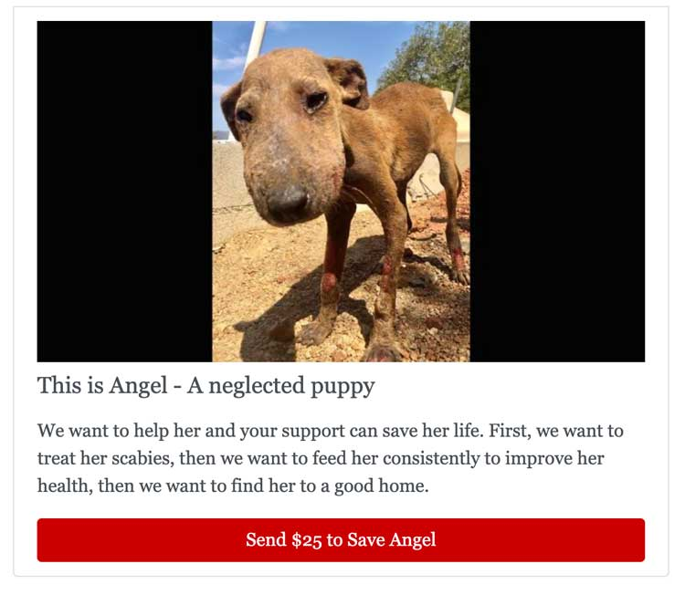

## Society Gain

Society Gain is an open source tool that empowers people to post listings and collect funds to execute those listings.

## What This Is

The best way to describe this is in an example.

Let's say you are a dog lover in Mexico named Anna. You love your town and it's amazing surf breaks... but the plight of the sick, neglected street dogs in the surrounding villiages makes you sad. Anna is a go getter. She creates an organization with the mission of bringing vetrenarian services to these surrounding villages and sterilizing the street dogs.

Her problem is that she has all these projects, but not enough resources. What more, being way down in south Mexico, she has no way to tell the world about it and get help.

Society Gain allows Anna to post images of the dogs she is trying to save and put a price on the resources needed to do the good work.

This way, when you find a cute malnourished puppy, you can take a few photos and put up a post that says how much it will cost to save the little guy.

## User Story

- [ ] Setup Users + Devise User Authentication
- [ ] Setup Post - [author, title, body, category] with ActiveText and ActiveRecord
- [ ] Setup Organizations - [name, location, mission, description]
- [ ]
- [ ] Setup Payments Via Stripe
- [ ] DevOps - This needs to be easy to setup for free
- [ ]

## Getting Started as a Developer

...more to come...
